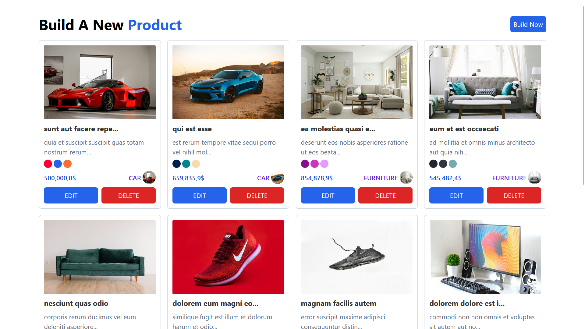
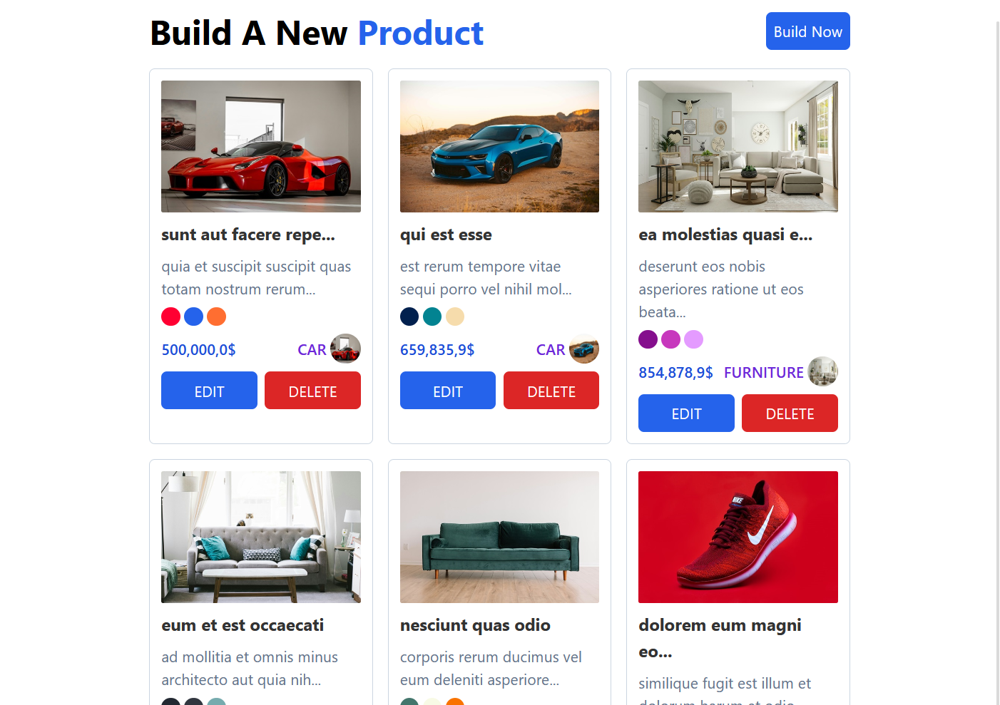

# Product CRUD Application

This is a **CRUD (Create, Read, Update, Delete)** application for managing products. The project was built using **React.js**, **TypeScript**, and **Tailwind CSS**.

## Features

- Add new products with the following details:
  - Title
  - Description (30 to 150 characters)
  - Image URL
  - Price
  - Category
  - Colors
- View a list of all products.
- Edit product details.
- Delete products.
- Responsive design using Tailwind CSS.

## Live Demo

Check out the live version of the application: [Product Builder](https://react-prodcut-builder-v1.netlify.app/)

## Screenshots

Here are some screenshots of the application:

1. **Desktop Version**

   

2. **Tablet Version**

   

3. **Small Tablet Version**

   

4. **Mobile Version**

   

## Tech Stack.🤝

- **React.js**: JavaScript library for building user interfaces.
- **TypeScript**: Strongly typed programming language that builds on JavaScript.
- **Tailwind CSS**: A utility-first CSS framework for building responsive and custom designs.
- **React Hot Toast**: To Add Add beautiful notifications to my app and enhance ux.

- **Vite**: Fast build tool that provides an optimized development environment.

## Installation.⚡

1. Clone the repository:
   ```bash
   git clone https://github.com/abdallahawad3/React-Product-Builder.git
   ```
2. Navigate to the project directory:
   ```bash
    cd React-Product-Builder
   ```
3. Install dependencies:
   ```bash
   npm i
   ```
4. Start the development server:
   ```bash
   npm run dev
   ```

## MIT License

Copyright (©️) 2024 Abdullah Awad
